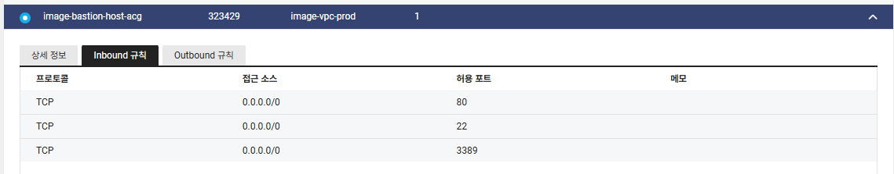

## 네이버 클라우드 서비스 배포


### public subnet 설정 및 server 내 sw 설치

- public subnet의 인바운드 80포트를 열어 놓기



- **Nginx 설치**
    - 패키지를 업데이트합니다. (서버 당 한번씩만 진행)
      • 서비스 다시 실행하라는 창이 나오면 `Tab`키를 눌러서 `Cancel`하면 됩니다.
    1. `sudo apt-get update`
    2. `sudo apt-get upgrade`
    - Nginx를 설치합니다.
    1. `sudo apt-get install nginx`
    2. `sudo apt-get install nginx-core`
    3. `sudo apt-get install nginx-extras`
    4. `sudo apt-get install nginx-light`
    - Nginx 버전 확인
        - `nginx -v`
    - Nginx 실행 및 상태 확인
        - `sudo systemctl restart nginx`
        - `sudo systemctl status nginx`
        - `sudo netstat -tulpn`

- **Nginx 설정 바꾸기**

  `/etc/nginx/site-available/default` 파일 수정

    ```bash
    # Default server configuration
    #
    server {
    	listen 80 default_server;
    	# listen [::]:80 default_server; # 이 코드 주석 처리하기!
    ```

  | 코드 | **의미** | **역할** |
      | --- | --- | --- |
  | **`listen [::]:80`** | Nginx가 **IPv6 주소**를 통해 80번 포트로 트래픽을 수신하도록 설정합니다. | IPv6 네트워크 환경에서 Nginx가 접속을 받을 수 있도록 합니다. |
  | **`#` (주석 처리)** | 이 설정을 **비활성화**합니다. | Nginx가 IPv6를 통한 접속을 리스닝하지 않도록 합니다. |

  **왜 이 코드를 주석 처리해야 했을까요?**

    - 두 개 이상의 `server` 블록이 동일한 IP 주소/포트 조합에 대해 `default_server`로 지정되거나, IPv4와 IPv6에서 각각 `default_server`로 지정될 때 Nginx가 **충돌(conflict)**을 일으킬 수 있습니다.
    - 현재 사용자의 환경이 IPv4 기반으로 충분하다면, IPv6 리스닝을 주석 처리함으로써 **잠재적인 설정 충돌을 방지**하고 Nginx가 오직 **IPv4 (80 포트)**에서만 기본 서버로 작동하도록 명확하게 설정하기 위함입니다.

  `/etc/nginx/site-enabled/default.conf` 파일 추가 및 아래와 같이 수정

    - server_name 및 proxy_pass 주소 수정 필수!

    ```sql
    server {
      # server_name _; 와일드 카드인데 이걸로 하면 위의 IP 주소로 넣어도 리버스 프록시가 안됨..
      server_name [NCP public IP 주소]; # NCP public IP 주소로 변경
      listen 80;
    
      location / {
    
        proxy_pass http://[private subnet의 ip 주소]:8080; # private subnet의 ip 주소 + 8080포트
        proxy_http_version 1.1;
        proxy_set_header Upgrade $http_upgrade;
        proxy_set_header Connection 'upgrade';
        proxy_set_header Host $host;
        proxy_set_header X-Real-IP $remote_addr;
        proxy_set_header X-Forwarded-For $proxy_add_x_forwarded_for; # 클라이언트 IP 전달용
        proxy_set_header X-Forwarded-Proto $scheme; # 프로토콜 전달용 (http/https)
        proxy_cache_bypass $http_upgrade;
    
      }
    }
    ```


### Private subnet 설정 및 sw 설치

- 인바운드 규칙 추가 : `22`, `8080` 포트와 `3306` 포트를 **bastion host**를 대상으로만 열어두기

  

- **JDK 설치**
    - 패키지를 업데이트합니다. (서버 당 한번씩만 진행)
      • 서비스 다시 실행하라는 창이 나오면 `Tab`키를 눌러서 `Cancel`하면 됩니다.
    1. `sudo apt-get update`
    2. `sudo apt-get upgrade`
    - 자바 OpenJDK 17 설치
    1. `sudo apt-cache search openjdk`  : 설치 가능한 항목 검색
    2. `sudo apt-get install openjdk-17-jdk`  : OpenJDK 17 - JDK 설치
    3. `sudo apt-get install openjdk-17-jre` : OpenJDK 17 - JRE 설치
    - 자바 설치 정상 완료 확인
    1. `java --version`
    2. `javac --version`
    - 자바 프로그램 정상 작동 확인
    1. `sudo nano hello.java`

        ```sql
        public class hello {
        	public static void main(String[] args) {
        		System.out.println("Hello Java Test!!");
        	}
        }
        ```

    2. `javac hello.java`
    3. `java hello`

- **mysql 설치 및 설정**
    - mysql 설치
    1. `sudo apt-get install mysql-server`
    - mysql 버전 확인
    1. `mysql --version`
    - mysql 실행
    1. `sudo systemctl start mysql`
    2. `sudo service mysql start` : 컨테이너 환경에서 실행하는 방법
    - mysql 서버 접속
    1. `sudo mysql -u root -p`
    - mysql 계정 및 스키마 생성 및 설정

    ```sql
    sudo mysql -u root -p
    
    CREATE USER 'ssg'@'%' identified by 'Ssgmysql1234!';
    CREATE USER 'ssg'@'localhost' identified by 'Ssgmysql1234!';
    GRANT ALL PRIVILEGES ON *.* TO 'ssg'@'%' with grant option;
    GRANT ALL PRIVILEGES ON *.* TO 'ssg'@'localhost' with grant option;
    flush privileges;
    
    select host, user from mysql.user; // 권한 확인
    
    create schema mygallery collate utf8mb4_general_ci;
    ```

    - 외부 접속 권한 설정

  `etc/mysql/mysql.conf.d/mysqld.cnf` bind-address 설정

    ```sql
    bind-address = 0.0.0.0
    ```

    - mysql 재시작하기 필수!!

  `sudo systemctl restart mysql`

- mysql 인텔리제이 접속
    - Name은 원하는것
    - Host 는 private subnet의 ip 주소
    - User는 권한 설정한 ssg, Password: ssg의 비밀번호

  

    - SSH tunnel 설정해야됨 (public subnet을 통해서 private subnet의 3306 포트로 들어가야 하므로)
        - Use SSH tunnel 체크
        - SSH configuration은 public subnet 설정을 하되 pem키로 접속하는 환경이 아닌 아이디, 패스워드로 접속하는 환경으로 세팅해야 db 접속이 된다.

      

      

    - intelliJ datasource로 접속하여 콘솔을 통해서 테이블 및 데이터를 넣는다

      

- 빌드 파일 설정 및 private subnet안의 server에 가져다 놓기
    - `application.properties` 파일 수정
        - private subnet의 ip 주소로 url 변경
        - **‼ ip 주소 대신에 `localhost` 로 변경하면 더 빠르다고 한다. NIC 까지가서 MAC 주소를 확인하지 않기 때문에** 
        - username, password를 설정한 아이디, 패스워드로 설정

  

    - 빌드 : `./gradlew bootJar`
    - 빌드 파일 이동
        - NCP public subnet의 서버에 아무대나 가져다 놓는다(어차피 private subnet의 서버로 옮겨야 된다!)
            - 아래 그림은 `/home/` 에 다가 .jar 파일을 가져다가 놓았다.

      

        - `scp` 로 빌드 파일 private subnet으로 이동
            - `scp /home/myGallery-0.0.1-SNAPSHOT.jar root@10.0.2.6:/root/applications/mygallery/`
            - 물론 이 명령어를 치기 전에 private subnet 안의 서버에 디렉토리를 만들어 놓자! (`mkdir applications`, `cd mygallery` `mkdir mygallery` )
- 빌드파일  수행
    - `java -jar myGallery-0.0.1-SNAPSHOT.jar`
    - `nohup`으로 터미널 꺼도 수행하게 해도 된다

### 배포 성공!


